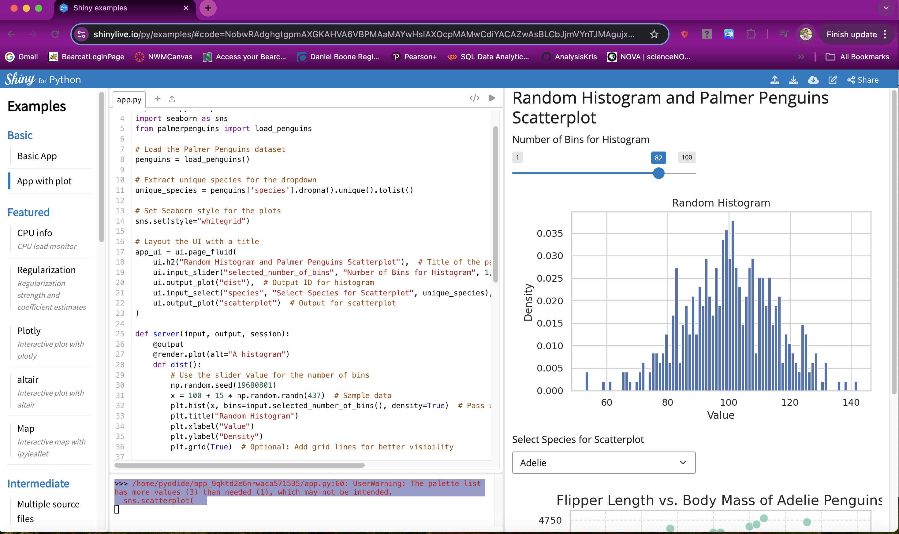

# Module 1 Assignment 
## Browser Interactive App: Slider Input & Histogram Output
- CONTINUOUS INTELLIGENCE 808182FA24
- Kristen Finley

## Objective
To implement a working interactive web app written in Python running in the browser, using Shiny Playground.

## Overview
This project is a Shiny application built with Python to visualize data from the **Palmer Penguins** dataset. The application features two main components:
1. A histogram generator for visualizing random data.
2. A scatter plot for exploring the relationship between flipper length and body mass for different penguin species.

## Features
- **Random Histogram**: Users can adjust the number of bins for the histogram using a slider. The histogram visualizes random normally distributed data.
- **Scatter Plot**: Users can select their favorite penguin species from a dropdown menu to view a scatter plot of flipper length versus body mass. A regression line is included to highlight trends in the data.

## Technologies Used
- Python
- Shiny for Python
- Matplotlib for plotting
- Seaborn for enhanced data visualization
- Palmer Penguins dataset from the `palmerpenguins` library
- NumPy and Pandas for data manipulation
  
## Project Output
Below is the link and a screenshot of the application running in the Shiny playground:
### Shiny App Link
[Random Histogram and Palmer Penguins Scatterplot](https://shinylive.io/py/app/#code=NobwRAdghgtgpmAXGKAHVA6VBPMAaMAYwHsIAXOcpMAMwCdiYACAZwAsBLCbJjmVYnTJMAgujxM6lACZw6EgK4cAOhD4ChTGFDKoANsTJ6OAIyzZ9hplBZN9ZVesHCIC-jxtMIqR-2es4KBNBCGtbFggWVXpGOyg9eDpUSgBzJUjeP00DKGkAfWSINK4oiFUAYiYAGWJcpjI2OCYABXjEltT022kdGzgHb06SpgBeJhz8wuLIgAoASlUKpgBRAA8yOihCYQU1AEcFJpZkwg44WxpBesamaQZUaWIAdzLXfcO847hT89G7IciwGUYC+PyiYAAuhg7sRUNB5hhdhwDnAEWRiMYWGR5osIJUAMr9JiEoIhVhkbB6JqXOjXJqWMilCIsDAsfozLGUuAjYFPTgUFJ0DjSYELV6VKpQbDEBTCBpNACqAEkmE8OA1rPV1VTVGhUHklH8lFgoCk4HkaHolNIZqomPamMa2AAmW1gABKUAgj2YAAkOFjiILYNZvS02nIOkUusTCDoKEkDA4wHMJExKgAVbVNYg0OlxM12h3GrioWWfYyyOi20IOuvAtlU7ZwfKuGAmOR5XN5EwlYESYEAOTcHdpuaYACFhjSmP7A8GYP2mABGCTLgAM64kzvXRftqftBMrkZnnHnm2Yvcie8dHAwMt05YZbukAeTB-TTAA8rKy8IlQAIkwp5vkGF43iW3jlo23zYje9YgicZzggOYCEk2wj4khvwzvicZkAmDJLkiKKfNhpR1h+lQAfcjwvMBVygshqrqmw1h6HoTCwmQHCkBRxZ3g+f4FEmbosPhhFJqKaaVD+j7CDO4nxnIREQGKuKyHmbJ0AAbnIMylrKEhCUZAQsCwvFqYgN4AAImQMdY2VI3pyFgonxGQPJgCITBnuiC6ijemm3G+8zWbWdaHkwCpsvmLDHrSOnxIcDG0vKXgjpG45XvxkVeJgmzeowrJwC2MzLgAnAAbAAHOudXLmKeX2qsfwbuuTAANQrgArEwABU+UYIVPrDV60gQDMAAsADMADscxRfisD6E0PRkFA8EOvYGB+TWzWRasEg5SMhlkCVGEtnkbajl2NA9iU8wSLIkTqtgIwZnQhxbfuUWtOZjrabwUHCDlP12Ho508UYqLAp6RV+qBAUpuDO2rHoQRwHoboAGrJXAgURZFO2Upj2PAgBlAWRShMHTtgrCjMn2HItn5fqgPGkPEiCiNI0hMAz-PGBAOFXB2BGRjpAamBwxg068jn2bZzlVm5hgzB5XmtAkkbNACth4cpiZWGqGoZmwDAKCkbDCwTKNE8FSkS8b2JzOFB0SrU-Ppdr7R69GwzrX0DnNVMMZjBMBT6ziCvNZUABissJvmQdsqDfT86QcVY7BLasOR4Mwc2+RMb8Yxnay5ExwdHBaTnxdkd8zEBl4ViDqQcDuwdDo0EnchXWHwxjIPgIjywQKIU35zAhCoxjEXFAl+RELg1jbJd93wF91Ikz638Y+4h7TAAMJSDoTRQKwEkqUmXF5paHDoJGVJFBqOkskwwTSDw2gA6bbGXwaJba2ttUaQwwL3NIUgZiQIsgAL25OVLcTAqpzHUkTOslRT6BAoJqEgBhaSoHiP0XBM50oLzzqXXKxNiESz+MyDA+DBAFFoRQfam8mDAkJGQZ0S4IB5CYXQFgIxlzg1ZrJCAegeAizzh3JggjUrZ0uvzKhh844nzPrgp2ycGQsQ1BsL0xwoDOUINgQukRWTXxduwzeQcRi90hv3XeAdIh4HBnWVYXkH5PzoHkF+KQGh5BgIufA7iHTvWBF-bAQSbAsDyCkfsYT7SCJGEQqkEtgDrghG4jBzVhHtRyRw9iqA2BQBGOuDAc1CkcJbGaFJvJEm5N+p+ZY0gzTyIxFcGc4tk5Swsr2OWZjY55UqCIPm+YpCCnOBZLOoCmmsAsZM58STbi9HsdvAe+tqmb08cCbxyRfH+MCcExpRSIlgCiTE8y8TTkcO0XIEY8d4hsm2d3epYAd63M3hjDsegvLujgFM8yllqhcDtq8g6pwRjtxFhCh06C6bgOhlSGx3caDAnjsYHx1RUhvw-hOYg38mAAFlYl3yYCAChS8p4sAAL5RmmChBi5B4HcmXFVMRYDzrozJm6TFj8Dk4tfmxGYwSFj4GZYyDgCCRFTSaqHcBpNflugJUS0lAMZgpHFRIS4LLpVsrlVyjAVIzTehmMi7kXCC4St1VKmVy5nTyryvTIUNpmZwAkLbTkVIvIAFpfVLniCUspFTUFRSVPwBgel+aCyNTxa2ZA-FSgfPMKKYyABWCgsTjGTbKXESxj7xE4mIVAqb0QdPbGC6w6ADQcFDCouQelqyLS4OWr0wMExbB4npatPhoDoD+CWjWNalASG0k2sUYBaUQiAA)
### Screenshot

## Acknowledgments
- The Palmer Penguins dataset is an excellent resource for exploring statistical concepts in a biological context.
- Special thanks to the developers of Shiny, Matplotlib, and Seaborn for their powerful data visualization libraries.
- Acknowledgment to [Winston Chang](https://www.youtube.com/watch?v=pE7109d4Sgs&t=238s) for his insightful video on **Plot Outputs in Shiny for Python**, which helped guide the development of this application.
- Thanks to ChatGPT for assistance in code development and debugging.
